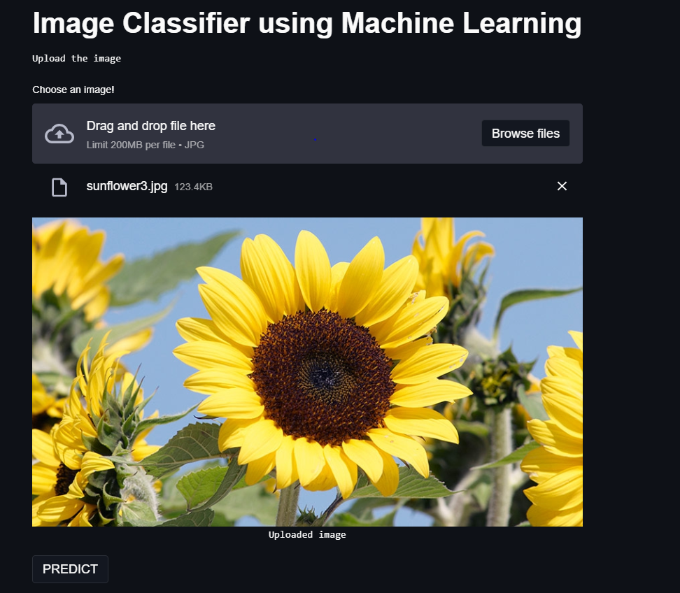

# Mini Project using Machine Learning
Link to Project in Google Colab: https://colab.research.google.com/drive/1IwPaOxxPp-kjl3PwfDHkVYSoI0pS6aFJ?usp=sharing   
Link to Dataset: https://drive.google.com/drive/folders/1xC7gJe6ze95gntQ5YoH__XnupD04pa5b?usp=sharing
## Project: Image Classifier using Machine Learning
### **Image classifier**:
#### What is it about?
Image classifier will predict the output of the image uploaded.
The machine is trained only to tell the difference in 3 categories of images.
1. Ice cream cone
2. Pretty Sunflower
3. Rugby ball leather 
*If an image other than the above category is uploaded, it will decide the category which is most similar amongst the three. It will also display the similarity percentages with respect to the 3 categories.*
#### INPUT: 
_An image will be uploaded._
#### How & Where? See below in the web app created.

#### OUTPUT:

### Model In-Depth Technical Description:

#### Dataset:
 - The images folder containing 30 images of each category is the dataset which is stored in their 3 respective folders.
 - This data is pre-processed for further use.

#### Algorithm used for Image Classification:
 - Support Vector Machine (SVM)

#### Deployment into Web-App
 - Using streamlit 

#### Testing Images Folder:
 - Images to be tested for predicting the output
